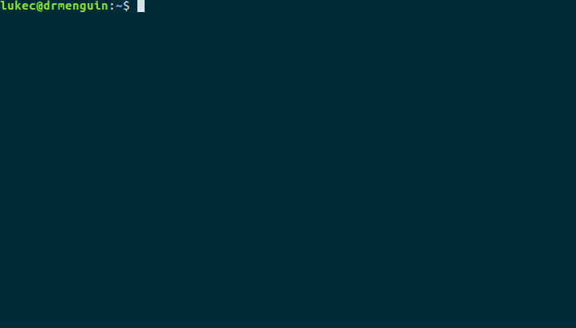

# MiniLang: An Interpreter Written in C++

This interpreter and REPL software were developed as part of a programming assignment for [CPS2000: Compiler Theory and Practice](https://www.um.edu.mt/courses/studyunit/CPS2000), a course forming part of my B.Sc. in Mathematics and Computer Science.

 

# The MiniLang Language

Minilang is an expression-oriented strongly-typed programming language. The language supports C-style comments, that is, `//...` for single-line comments and `/*...*/` for multiline comments, is case-sensitive, and every function is expected to return a value. There are four datatypes in the language: `int` for integer values, `real` for floating point numbers, `bool` for boolean values and `string` for string literals. The language detects when integer values are assigned to real variables and performs an automatic typecast, except for the case of function parameters. For example, the function call `f(1)` would be invalid if the `f` expects a `real` argument, so we must write `f(1.0)` or `f(1.)`.  In turn, this strictness allows for multiple functions of the same name to be defined within the same scope, provided they have different signature. MiniLang supports variable shadowing.
    
The following code listing showcases some of MiniLang's syntax. 

    def square(x : real) : real {
        return x*x;
    }

    def repeat_string(s : string, n : int) : string {
       /* Repeats string s, n times */
       var s_rep : string = "";
       while(n > 0){
          set s_rep = s_rep + s;
          set n = n - 1;
       }
       return s_rep;
    }
    
    def fac(n : int) : int {
       /* Recursive factorial */
       if (n == 0) { return 1; }
       else { return n * fac(n-1); }
    }
       
    print fac(5) - square(5.);             // 95
    print repeat_string("Hello", 10);  
    print square(fac(5)+0.);               // 14400

    def f(x : int) : int {
       def g(x : int) : int {
          // the x outside is shadowed by the argument x
          set x = 2*x;
          return x + 3;
       }
       return g(x) + 7;
    }

    print f(5);                           // 20

### MiniLang Production Rules in Extended BNF
The following extended BNF production rules describe the entire grammar of MiniLang.

    ‹program›           = { ‹statement› } 

    ‹block›             = "{" { ‹statement› } "}"

    ‹statement›         = ‹variable-decl› ";"
                        | ‹assignment› ";"
                        | ‹print-statement› ";"
                        | ‹if-statement›
                        | ‹while-statement›
                        | ‹return-statement› ";"
                        | ‹function-decl›
                        | ‹block›

    ‹function-decl›     = "def" ‹identifier› "(" [‹formal-params›] ")" ":" ‹type› ‹block›

    ‹formal-params›     = ‹formal-param› { "," ‹formal-param› }

    ‹formal-param›      = ‹identifier› ":" ‹type›

    ‹while-statement›   = "while" "(" ‹expression› ")" ‹block›

    ‹if-statement›      = "if" "(" ‹expression› ")" ‹block› ["else" ‹block›]

    ‹return-statement›  = "return" ‹expression›

    ‹print-statement›   = "print" ‹expression›

    ‹variable-decl›     = "var" ‹identifier› ":" ‹type› "=" ‹expression›

    ‹assignment›        = "set" ‹identifier› "=" ‹expression›

    ‹expression›        = ‹simple-expression› { ‹relational-op› ‹simple-expression› }

    ‹simple-expression› = ‹term› { ‹additive-op› ‹term› }

    ‹term›              = ‹factor› { ‹multiplicative-op› ‹factor› }

    ‹factor›            = ‹literal›
                        | ‹identifier›
                        | ‹function-call›
                        | ‹sub-expression›
                        | ‹unary›
                        
    ‹unary›             = ( "+" | "-" | "not" ) { ‹expression› }

    ‹sub-expression›    = "(" ‹expression› ")"

    ‹function-call›     = ‹identifier› "(" [‹actual-params›] ")"

    ‹actual-params›     = ‹expression› { "," ‹expression› }

    ‹relational-op›     = "<" | ">" | "==" | "!=" | "<=" | ">="

    ‹additive-op›       = "+" | "-" | "or"

    ‹multiplicative-op› = "*" | "/" | "and"

    ‹identifier›        = ( "_" | ‹letter› ) { "_" | ‹letter› | ‹digit› }

    ‹literal›           = ‹int-literal›
                        | ‹real-literal›
                        | ‹bool-literal›
                        | ‹string-literal›

    ‹int-literal›       = ‹digit› { ‹digit› }

    ‹real-literal›      = ‹digit› { ‹digit› } "." { ‹digit› }
                        | "." ‹digit› { ‹digit› }

    ‹bool-literal›      = "true" | "false"

    ‹string-literal›    = "“" { ‹printable› } "”"

    ‹printable›         = ‹digit› | ‹letter› | " " | "!" | """ | "#" | "$" | "%" | "&" 
                        | "'" | "(" | ")" | "*" | "+" | "," | "-" | "." | "/" | ":" | ";" 
                        | "<" | "=" | ">" | "?" | "@" | "[" | "\" | "]" | "^" | "_" | "`" 
                        | "{" | "|" | "}" | "~"

    ‹letter›            = "A" | "B" | "C" | "D" | "E" | "F" | "G" | "H" | "I" | "J" | "K" 
                        | "L" | "M" | "N" | "O" | "P" | "Q" | "R" | "S" | "T" | "U" | "V" 
                        | "W" | "X" | "Y" | "Z" | "a" | "b" | "c" | "d" | "e" | "f" | "g" 
                        | "h" | "i" | "j" | "k" | "l" | "m" | "n" | "o" | "p" | "q" | "r" 
                        | "s" | "t" | "u" | "v" | "w" | "x" | "y" | "z" 

    ‹digit›             = "0" | "1" | "2" | "3" | "4" | "5" | "6" | "7" | "8" | "9"

# Instructions
The source files can be built using [CMake](https://cmake.org/download/) and the `CMakeLists.txt` file provided in the root directory. In a terminal, navigate to the root directory and run

    cmake .
    make
    ./minilang

to compile and execute the REPL.

# Documentation
A report describing the design process and motivation behind the interpreter is present in the root directory, filename `report.pdf`.

Detailed technical documentation of the source code can be found in the `docs` directory. Visit [this](https://cdn.rawgit.com/drmenguin/minilang-interpreter/master/docs/html/index.html) webpage to view the documentation in your browser, or pull the repository, navigate to the `docs` directory and open `index.html` for individual descriptions of the functions, classes and attributes in the project.
